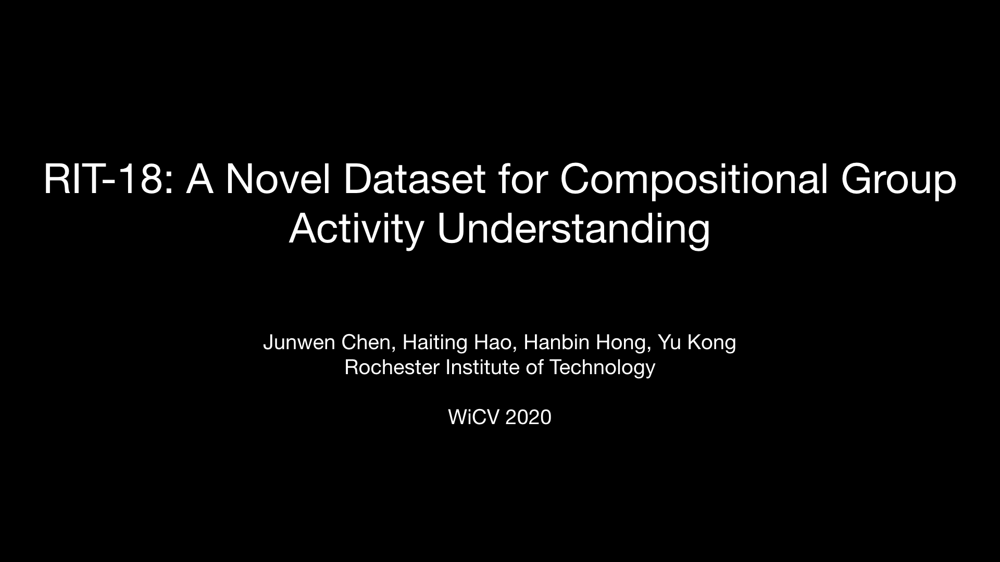

# :volleyball: [RIT-18 Dataset](https://pht180.rit.edu/actionlab/rit-18)

## Contents
0. [Overview](#overview)
0. [Download](#download)
0. [Details of Dataset](#details-of-dataset)
0. [Benchmark](#benchmark)
0. [Citation](#citation)

<a name="overview"></a>
## :globe_with_meridians:  Overview 

</a>

[](https://youtu.be/pi4f3qxBWMI)

RIT-18 is a novel compositional activity dataset collected by ACTION Lab at RIT containing 18 compositional activity classes. We collected video clips from 51 volleyball games on YouTube. With comprehensive annotations, RIT-18 is a large scale dataset for group activity understanding tasks such as group activity recognition, future activity anticipation, and rally-level winner prediction. The benchmark for these three tasks is provided. 

Besides the aforementioned tasks, we believe RIT-18 dataset is potential for other less explored tasks, for example, temporal group activity localization, individual contribution evalution, and game-level winner prediction. Welcome to play!

<a name="download"></a>
## :file_cabinet:  Download 

Download [here](https://drive.google.com/file/d/1gHNzXOSZMS-kR-cml_qqzRd0jeZSystt/view?usp=sharing)

<a name="details-of-dataset"></a>
## :card_index_dividers:  Details of Dataset

### Overall structure of the dataset

```
RIT-18
├── 0                  # folder for video 0
├── 1
│   ├── clips          # folder for clips
│   │   ├── 000.mp4
│   │   ├── ...
│   │   └── 029.mp4
│   ├── group.txt      # activity label for all the clips of the video
│   └── info.txt       # match description, video copyright, resolution and other format information
├── ...
├── 50
├── copyright.txt      # all the links to the videos
└── annotation.pkl     # all the annotations
```

### Activity Labels

We annotated 12035 frames picked from 1530 clips (51 videos * 30 clips / video) with 18 action labels.

| Activity Labels | No. of Instances | Activity Labels | No. of Instances |
|        ---      |  --:        |  ---            |  --:        |
|  l-serve        |  774        |  r-serve        |  756        |
|  l-firstpass    |  1395       |  r-firstpass    |  1395       |
|  l-set          |  1270       |  r-set          |  1266       |
|  l-spike        |  1012       |  r-spike        |  1014       |
|  l-volley       |  136        |  r-volley       |  143        |
|  l-drop         |  243        |  r-drop         |  235        |
|  l-shot         |  23         |  r-shot         |  23         |
|  l-block        |  393        |  r-block        |  427        |
|  l-winpoint     |  764        |  r-winpoint     |  766        |

### Annotation Format 

**group.txt**

```
[clip-name].mp4
[a b] [a b] [left/right]
[key-frame-num] [start-frame-num] [end-frame-num] [key-time] [start-time] [end-time] [activity-label] [bounding box]
[key-frame-num] [start-frame-num] [end-frame-num] [key-time] [start-time] [end-time] [activity-label] [bounding box]
[key-frame-num] [start-frame-num] [end-frame-num] [key-time] [start-time] [end-time] [activity-label] [bounding box]
[key-frame-num] [start-frame-num] [end-frame-num] [key-time] [start-time] [end-time] [left/right winpoint]
    
e.g.
    000.mp4
    0 0 0 1 left
    000000 000000 000026 0.000 0.000 0.520 r-serving 1073 330 1147 533
    000052 000027 000101 1.040 0.540 2.010 l-passing 355 382 422 589
    000124 000102 000164 2.480 2.030 3.285 l-setting 513 426 574 623
    000182 000165 000201 3.640 3.305 4.020 l-spiking 472 381 541 601
    000202 000202 000247 4.040 4.040 4.940 l-winpoint
```

**info.txt**

```
startTeam: [left/right]
winner: [left/right]
score: [a b]
1: [a b]
2: [a b]
3: [a b]
4: [a b]
link: [download link]
frameRate=[fps]
imWidth=[frame image width]
imHeight=[frame image height]
imExt=[frame image extension]

# 'left' and 'right' stand for the team position when the match or video begins
# 'a' is the score of 'left'
# 'b' is the score of 'right'

e.g. 
    startTeam: right
    winner: right
    score: 3 0
    1: 25 22
    2: 28 26
    3: 26 24
    link: https://www.youtube.com/watch?v=A1B2C3D4E
    frameRate=25
    imWidth=1920
    imHeight=1080
    imExt=.jpg
```

<a name="benchmark"></a>
## :construction:  Benchmark 

### Rally-level winner prediction
Winner Prediction baseline test.
```
cd winner
python scripts/test_volleyball_winner.py
```

### Our Poster
</a>

<a name="citation"></a>
## :bookmark_tabs:  Citation

Please cite our CVPR Workshop paper if use this dataset.

```
@InProceedings{RIT18_2020_CVPR_Workshops,
    author = {Chen, Junwen and Hao, Haiting and Hong, Hanbin and Kong, Yu},
    title  = {RIT-18: A Novel Dataset for Compositional Group Activity Understanding},
    booktitle = {IEEE Conference on Computer Vision and Pattern Recognition Workshop},
    month  = {June},
    year   = {2020}
}
```
